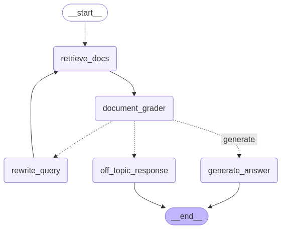
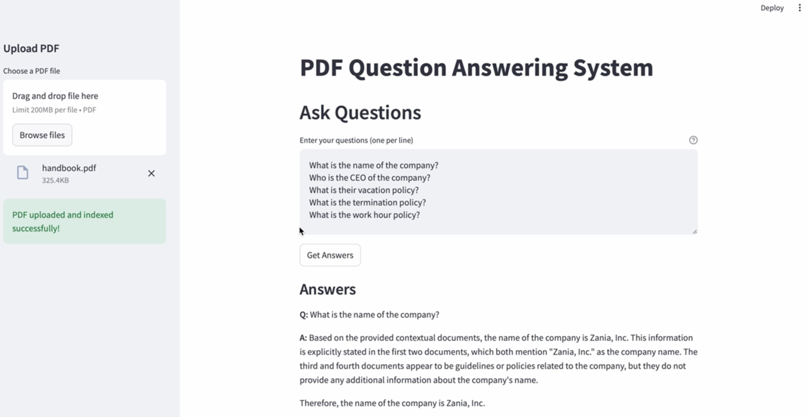

# AgenticRAG
AgenticRAG is a FastAPI-based application designed to enable users to upload PDF files, index their content, and retrieve precise answers to their questions. Leveraging advanced vector store technology for document retrieval and a language model for response generation, this application provides a seamless and intelligent question-answering experience

---
# Overview

This project is built around *LLama 3.1 8B Instant*, a powerful language model, and is optimized for its capabilities. While the prompts and configurations are tailored for LLama 3.1, the codebase is designed to be flexible and can be adapted to work with other models, such as *OpenAI's GPT*.

## Key Features

- **PDF Upload and Indexing**: Upload PDF files and automatically index their content for efficient retrieval.
- **Question Answering**: Ask questions and receive accurate, context-aware answers based on the indexed content.
- **Multi-Agent Workflow**: A sophisticated multi-agent system ensures high-quality responses by leveraging document relevance grading, query optimization, and answer generation.
- **Streamlit UI**: A user-friendly interface for interacting with the application.

## Multi-Agent Workflow

The application follows a multi-agent flow to ensure robust and accurate question answering. Below is a visual representation of the workflow:



### Workflow Steps:

 - Document Retrieval: Retrieve relevant documents from the indexed PDF.
 - Relevance Grading: Evaluate the relevance of retrieved documents to the user's question.
 - Query Optimization: Rewrite the user's question for better retrieval and understanding.
 - Answer Generation: Generate precise and context-aware answers based on the retrieved documents.

*Below shows the streamlit ui of the app*





## Steps to Start with this Repo

  ```bash
  git clone https://github.com/ankurdhuriya/AgenticRAG.git
  cd AgenticRAG
  export PYTHONPATH=$(pwd)
  ```

  ```bash
  conda create -n my_env python==3.12.9 -y
  conda activate my_env
  pip install -r requirements.txt
  ```
  - create '.env' file with api keys either of GROQ_API_KEY or OPENAI_API_KEY

  ```bash
  python app/main.py
  ```

  This will start the backend fastapi server

  ```bash
  streamlit run app/streamlit_run.py
  ```

  This will run and streamlit UI app.
  


## API Usage

### 1. Health Check
Check if the API is running.

- **Endpoint**: `GET /health`
- **Response**:
  ```json
  {
    "status": "ok"
  }
  ```

- **Example**: 
  ```bash
  curl -X GET http://0.0.0.0:8000/health
  ```

## 2. Upload PDF
Upload a PDF file to be indexed for question answering.

- **Endpoint**: `POST /upload-pdf`
- **Request**:
  - File : PDF file (form-data).
- **Response**:
  ```json
  {
  "message": "PDF file 'example.pdf' indexed successfully"
  }
  ```

- **Example**: 
  ```bash
  curl -X 'POST' \
  'http://0.0.0.0:8000/upload-pdf' \
  -H 'accept: application/json' \
  -H 'Content-Type: multipart/form-data' \
  -F 'file=@example.pdf;type=application/pdf'
  ```

## 3.  Ask Questions
Ask a list of questions and get answers based on the indexed PDF.

- **Endpoint**: `POST /ask`
- **Request**:
  ```json
  {
    "questions": [
        "What is the main topic of the document?",
        "Who is the author?"
        ]
  } 
  ```
- **Response**:
  ```json
  [
    {
        "question": "...",
        "answer": "....."
    },
  ]
  ```

- **Example**: 
  ```bash
  curl -X 'POST' \
  'http://0.0.0.0:8000/ask' \
  -H 'accept: application/json' \
  -H 'Content-Type: application/json' \
  -d '{
  "questions": [
     "What is their vacation policy?", "What is the name of the company?"
   ]
  }'
  ```

  

